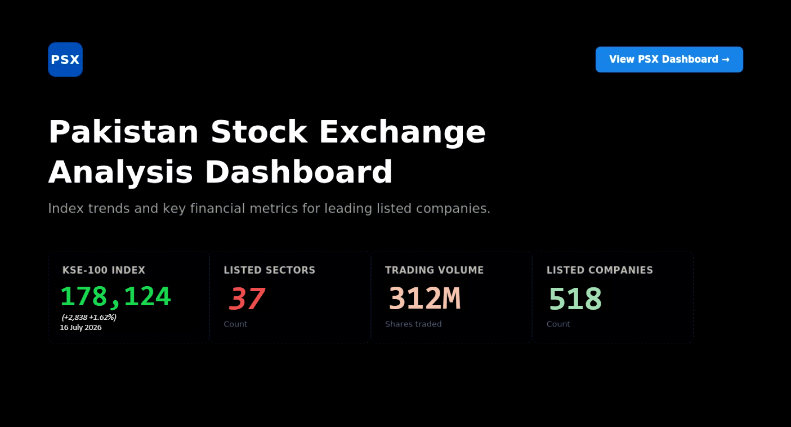

# Pakistan Capital Markets Intelligence Terminal (Power BI)

## 🎯 The Problem
Asset managers, corporate treasury desks, and quantitative analysts frequently struggle to reconcile macroeconomic indicators with micro-level equity performance. Critical financial data is heavily fragmented across isolated trading terminals, static balance sheet PDFs, and historical exchange filings. Market participants lack a unified, multi-horizon interface to simultaneously stress-test valuations for high-liquidity financial institutions, assess capital adequacy, and execute technical entry or exit strategies on volatile energy and industrial listings.

## 🛠️ The Technical Action
* **Engineered a Relational Financial Data Model:** Developed a robust Star Schema architecture connecting multi-year historical price actions, quarterly corporate earnings disclosures, and macroeconomic vectors into a unified data infrastructure across multiple sectors.
* **Modeled a 5-Year Banking & Corporate Health Matrix:** Programmed cross-sectional tracking logic to map long-term operational efficiency and balance sheet health trends, isolating moving trends across Capital Adequacy Ratios (CAR), Net/Gross Advances-to-Deposits Ratios (ADR), and asset utilization specifically for **United Bank Limited (UBL)**, **National Bank of Pakistan (NBP)**, **The Bank of Punjab (BOP)**, and **Mari Petroleum (MARI)**.
* **Programmed Automated Valuation Matrices:** Utilized advanced **DAX (Data Analysis Expressions)** to build programmatic screening filters, comparing live corporate Earnings Yields against risk-free sovereign benchmarks (11.63% KIBOR) to isolate structural mispricings and over/undervaluation signals for **UBL**, **NBP**, **Systems Limited (SYS)**, **The Hub Power Company (HUBC)**, and **Power Cement Limited**.
* **Designed Multi-Horizon Technical Terminals:** Created dynamic, interactive visual blocks supporting multi-frequency time-series filters (Yearly, Quarterly, Monthly, Weekly, Daily) integrated with active candlestick reconstruction (Open, High, Low, Close, LDCP) to trace institutional liquidity blocks for **OGDCL**, **MARI**, and **HUBC**.

## 🚀 The Result
Created an institutional-grade investment screening terminal that converts fragmented market metrics into active allocation signals. The platform enables fund managers to instantaneously evaluate macro yield spreads on banking giants like **UBL** and **NBP**, track structural volume profiles and support/resistance channels on **BOP** and **SYS**, and monitor technical trend cycles on high-beta heavyweights like **HUBC**, **OGDCL**, and **Mari Petroleum (MARI)**.

### 📊 Dashboard Preview    

### 🔗 Live Interactive Link
[Click Here to Launch Interactive Dashboard](https://tinyurl.com/MuhammadGhaziPSX)
